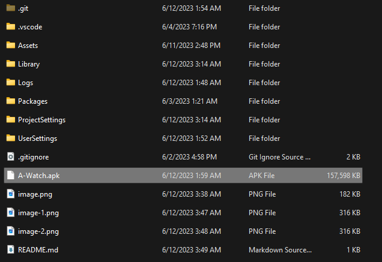

# A-Watch

## 1. Open Corresponding Unity Project

## 2. Click File > Build Settings
    

## 3. Choose Android Platform

## 4. Click Build and Run

### You will get APK file as below after finished building

## 5. Install APK File in Your Phone

## 6. Open the installed file